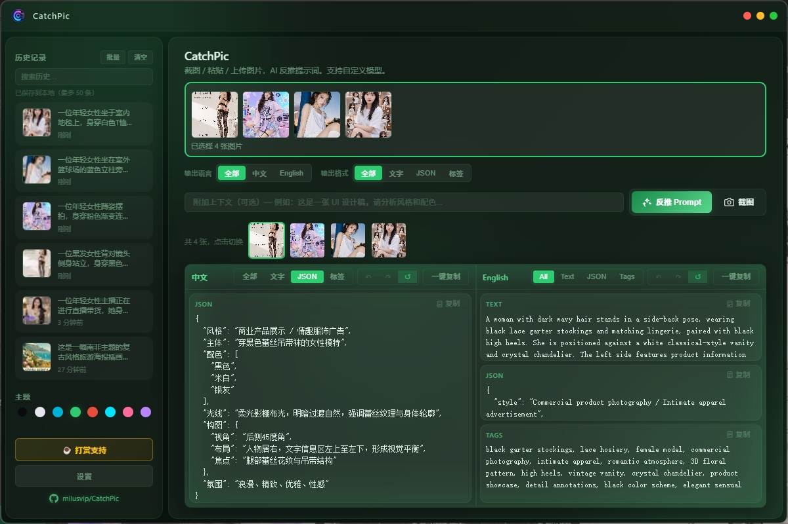

  

<h1 align="center">CatchPic</h1>

  截图 · 粘贴 · 上传图片，一键 AI 反推中英文 Prompt

  
  

---

## 简介

CatchPic 是一款桌面端图片反推工具，面向 AI 绘画、设计参考与内容创作：对图片进行视觉理解，自动生成**中文描述、English prompt、结构化 JSON、关键词标签**，并支持按需选择输出范围以节省 Token。

API Key 与历史记录均保存在本机；图片分析请求直连您自行配置的模型 API。

  

---

## 功能详解

### 多种方式导入图片

- **区域截图**：像微信截图一样框选屏幕区域，支持多显示器；Windows 下可识别窗口边界，方便精确框选（macOS 支持多屏截图）
- **粘贴图片**：支持 `Ctrl+V` / `⌘V` 快速粘贴——浏览器复制的图像、截图工具复制的内容、资源管理器 / Finder 里复制的图片文件均可
- **拖拽 / 选择文件**：将 PNG、JPG、WebP 等拖入上传区，或点击批量选择
- **多图队列**：一次可上传多张图片，结果区底部切换缩略图逐张查看与反推

### AI 视觉反推

- 对接 **OpenAI 兼容** 视觉 API（如阿里云 Qwen-VL、GPT-4o 等），在设置中自定义模型名称与 API 地址
- 可填写**附加上下文**（例如「这是 UI 设计稿，请分析配色与布局」），引导模型按场景输出
- 反推过程中灵动岛提示进度；失败项可单独**重试**
- 支持**分析前压缩大图**（设置 → 常规），在尽量保留透明 PNG 的前提下减小体积、节省 Token

### 灵活的输出控制（省 Token）

顶栏 **输出语言**、**输出格式** 决定**下一次反推** API 实际生成什么，而不是简单隐藏已有内容：

| 输出语言 | 可选 |
|----------|------|
| 全部 | 同时生成中文 + English |
| 中文 / English | 只生成对应语言 |

| 输出格式 | 可选 |
|----------|------|
| 全部 | 文字 + JSON + 标签 |
| 文字 | 自然语言描述（主体、风格、配色、光线、构图等） |
| JSON | 结构化字段，便于程序读取 |
| 标签 | 逗号分隔关键词，适合作图 Tag |

只选「中文 + 文字」时，不会浪费 Token 去生成英文或 JSON。

### 双语结果区

反推完成后，结果区分 **中文**、**English** 两栏，各自独立：

- 栏内 Tab：**全部 / 文字 / JSON / 标签**，互不影响
- 当次生成了「中英 + 全部格式」时，三行对齐展示（文字一行、JSON 一行、标签一行）
- 只生成一种语言时，结果**全宽显示**，不占半屏空白
- 每栏支持**编辑**、撤销 / 重做 / 重置，以及**一键复制**（含当前栏全部内容）
- 顶栏 **一键复制** 可汇总当前图片的 Prompt 内容

### 历史记录

- 每次成功反推自动写入本地历史（最多保留 50 条）
- 支持**关键词搜索**、单条删除、**批量管理**与清空
- 点击历史可预览当时结果；可**恢复**到继续编辑当前工作区内容
- 数据保存在本机，不上传云端

### 快捷键与后台使用

- **全局快捷键**（可在设置中自定义录制）：
  - 区域截图——托盘后台时也生效
  - 提交反推——唤起窗口并开始分析
- 窗口可**最小化到托盘**，截图、反推不中断
- **截图后自动反推**（设置 → 常规，可选）：截完即分析，仅针对本次截图，不重跑队列里其它图片

### 外观与体验

- **8 套主题**：暗色、亮色、海洋、森林、日落、极光、樱花、午夜
- 上传区支持缩略图预览、点击放大
- 首次启动有引导配置 API；支持开机 / 登录自启（Windows / macOS）

---

## 下载与安装

前往 **[Releases](https://github.com/milusvip/CatchPic/releases)** 下载对应系统的安装包：

| 平台 | 文件 | 安装方式 |
|------|------|----------|
| Windows | 便携版 `.exe` 或安装包 | 解压 / 安装后双击运行即可 |
| macOS | `.dmg` | 打开后将 CatchPic 拖入「应用程序」 |

> 首次运行若遇系统安全提示，请按系统指引允许打开（Windows 可选「仍要运行」，macOS 在「隐私与安全性」中允许）。

---

## 快速开始

1. 启动 CatchPic  
2. 打开 **设置**，填写模型名称、API 地址与 API Key  
3. 上传 / 截图 / 粘贴图片  
4. 按需选择顶栏 **输出语言**、**输出格式**  
5. 点击 **反推 Prompt**

---

## 默认快捷键

| 操作 | Windows | macOS |
|------|---------|--------|
| 区域截图 | `Ctrl+Shift+A` | `⌘⇧A` |
| 反推 Prompt | `Ctrl+Enter` | `⌘↩` |
| 粘贴图片 | `Ctrl+V` | `⌘V` |

可在 **设置 → 快捷键** 中自定义。

---

## 隐私说明

- API Key 保存在本机用户目录（支持系统密钥链时优先使用）  
- 分析历史、偏好设置均存储在本地  
- 图片仅发送至您配置的 API 端点  

反馈问题时请勿附带 API Key 或敏感截图。

---

## 反馈与支持

- **问题反馈**：[GitHub Issues](https://github.com/milusvip/CatchPic/issues)  
- **功能建议**：欢迎通过 Issues 描述使用场景  

### 打赏支持

如果 CatchPic 对你有帮助，欢迎请作者喝杯咖啡 ☕

  

  微信扫码 · 推荐使用微信支付

应用内也可点击左侧栏 **「打赏支持」** 查看同一二维码。

---

  Made with ❤️ by <a href="https://github.com/milusvip">milusvip</a>

